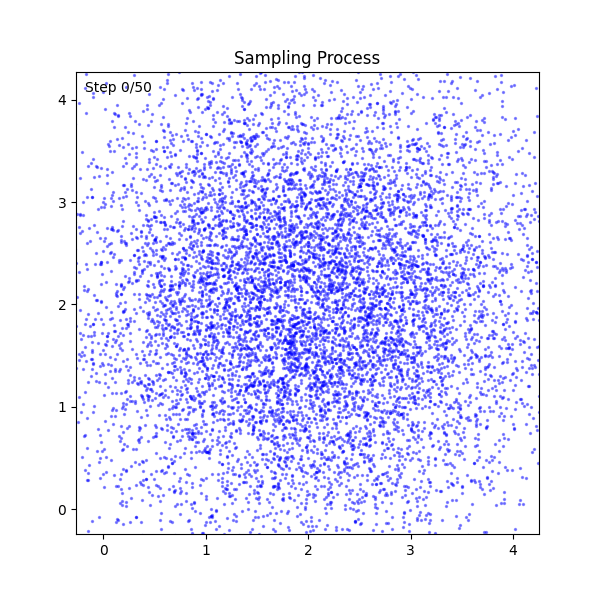

# 🌀 Diffusion Model 2D 📐

Educational project for learning score-based diffusion models through 2D
toy datasets.
A simple MLP learns to denoise samples from various 2D distributions, using
VP-SDE or VE-SDE forward processes and DPM-Solver++(2M) for fast sampling.

**⚡ This diffusion model can be trained in a few minutes on a consumer-grade GPU. Let's give it a try!**



## 🎯 Task

Learn a 2D data distribution via score-based generative modeling, then
generate new samples by reversing the diffusion process.

**Forward process (noising):**

```text
x_0 ~ p_data  →  x_t = α(t) x_0 + σ(t) ε,  ε ~ N(0, I)
```

**Reverse process (denoising):**

```text
x_T ~ N(0, I)  →  x_{t-1}  →  ...  →  x_0 ~ p_data
```

<!-- training_data.png -->
<!-- generated_samples.png -->
<!-- sampling_process.gif -->

## 🏗️ Model and SDE

* **Score network**: 4-layer MLP with ReLU activations
* **Predictor types**: `x_start`, `noise`, or `score` parameterization
* **Forward SDEs**:
  * **VP-SDE** (Variance Preserving): linear beta schedule from `beta_min` to `beta_max`
  * **VE-SDE** (Variance Exploding): geometric sigma schedule from `sigma_min` to `sigma_max`
* **ODE Solver**: DPM-Solver++(2M) — 2nd-order multistep solver in x0-prediction form

### 🔢 Datasets

Seven built-in 2D datasets are available:

| Dataset | Source |
|---|---|
| `two_moons` | scikit-learn |
| `swiss_roll` | scikit-learn |
| `circles` | scikit-learn |
| `s_curve` | scikit-learn (projected to 2D) |
| `spiral` | Custom |
| `pinwheel` | Custom |
| `checkerboard` | Custom (Numba-accelerated) |

### 🔗 Training pipeline

1. Sample a batch `x_0` from the training data
2. Sample random time `t ~ U(eps, 1)`
3. Compute noisy sample `x_t` via the forward SDE's marginal distribution
4. Predict the target (x_start, noise, or score) with the MLP
5. Minimize the weighted MSE loss

At sampling time, DPM-Solver++(2M) integrates the probability flow ODE
from `t=1` back to `t=eps` in a configurable number of steps.

## 📦 Installation

Make sure you have uv installed on your system. If you don't have it yet, you can install it by following the instructions [here](https://docs.astral.sh/uv/getting-started/installation/).

```bash
uv sync --extra dev
uv pip install -e .
```

## 🚀 Quick Start

Train:

```bash
uv run scripts/run_training.py --config config.yaml
```

This will train the model and save outputs (samples, plots, TensorBoard logs)
in the `outputs/` directory.

## ⚙️ Configuration

All settings are defined in `config.yaml`:

* `device` (CUDA or CPU)
* `seed` (reproducibility)
* `data.*` (dataset type, number of samples, noise level)
* `model.*` (predictor type, ODE solver, hidden size, SDE parameters)
* `training.*` (learning rate, weight decay, steps, batch size)
* `sampling.*` (number of generated samples, solver steps)


## 🛠️ Development

Install dev dependencies (includes pre-commit and ruff), then install hooks:

```bash
uv sync --extra dev
pre-commit install
```

Run all hooks manually if needed:

```bash
pre-commit run --all-files
```
